# SWE-Review Plugin

**Agentic code review on top of Claude Code / Cursor / OpenCode / Pi.**

SWE-Review 把"代码审查"做成 **Generate → Review → (Revise | Regenerate) → Verify** 的闭环：先让 AI 生成候选 PR，再用一个 repository-grounded 审查者探索代码、追踪调用链、产出结构化反馈；reviser 拿着反馈去修；verifier 在沙箱里跑测试。可作为 4 款 CLI 的 `SKILL.md` 安装到 `~/.claude/skills/` 与 `~/.pi/agent/skills/swe-review/`。

---

## 目录

- [1. 系统架构](#1-系统架构)
- [2. 闭环流程](#2-闭环流程)
- [3. 数据模型](#3-数据模型)
- [4. 快速开始](#4-快速开始)
- [5. Skill / SubAgent / Adapter 三层](#5-skill--subagent--adapter-三层)
- [6. CLI 命令](#6-cli-命令)
- [7. 在 Claude Code / Cursor / OpenCode / Pi 中使用](#7-在-claude-code--cursor--opencode--pi-中使用)
- [8. 评测指标](#8-评测指标)
- [9. 安全约束与不变式](#9-安全约束与不变式)
- [10. 参考与许可](#10-参考与许可)

---

## 1. 系统架构

### 三层次总览

```mermaid
flowchart TB
    subgraph User["👤 User / LLM Agent"]
        CLI["swe-review CLI<br/><i>argparse → asyncio</i>"]
        SK["/skill swe-review-*<br/><i>Claude Code / OpenCode / Pi</i>"]
    end

    subgraph Skills["🧠 Skill Layer (skill.py)"]
        direction LR
        ES[ExploreSkill<br/><i>收集仓库上下文</i>]
        AS[AnalyzeSkill<br/><i>静态 diff 分析</i>]
        GS[GenerateSkill<br/><i>生成候选 PR</i>]
        RS[ReviewSkill<br/><i>审查候选 PR</i>]
        RVS[ReviseSkill<br/><i>按反馈修订</i>]
        VS[VerifySkill<br/><i>沙箱验证</i>]
        LS[LoopSkill<br/><i>编排闭环</i>]
    end

    subgraph SubAgents["⚙️ SubAgent Layer (subagents/)"]
        direction LR
        E[ExplorerSubAgent<br/><i>grep + 调用链追踪</i>]
        A[AnalyzerSubAgent<br/><i>hunk 统计 + API 检测</i>]
        G[GeneratorSubAgent<br/><i>LLM 生成 diff</i>]
        R[ReviewerSubAgent<br/><i>LLM 审查 + JSON 报告</i>]
        RV[ReviserSubAgent<br/><i>LLM 修订 diff</i>]
        V[VerifierSubAgent<br/><i>git apply + 测试</i>]
        L[LoopSubAgent<br/><i>状态机 + 策略分发</i>]
    end

    subgraph Adapters["🔌 Adapter Layer (tools/)"]
        CCA[ClaudeCodeAdapter<br/><i>claude -p</i>]
        CA[CursorAdapter<br/><i>agent --print</i>]
        OA[OpenCodeAdapter<br/><i>opencode run</i>]
        PA[PiAdapter<br/><i>pi --mode print</i>]
        ST[ShellTools<br/><i>离线占位</i>]
    end

    User --> CLI & SK
    CLI --> Skills
    SK --> Skills
    Skills --> SubAgents
    SubAgents -.->|chat / call LLM| Adapters
```

### 数据流

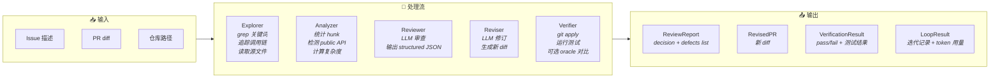

---

## 2. 闭环流程

SWE-Review 提供 **3 种闭环策略**，由 `LoopSkill` 统一编排：

### 2.1 策略总览

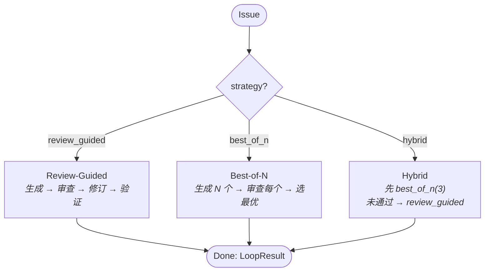

### 2.2 Review-Guided（默认）

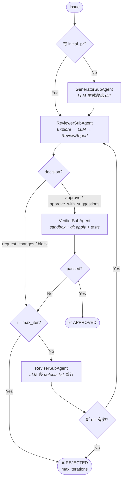

### 2.3 Best-of-N

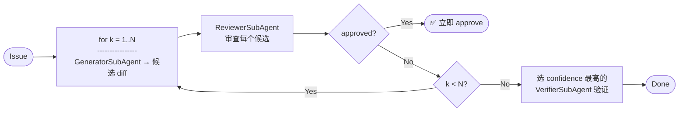

### 2.4 Hybrid

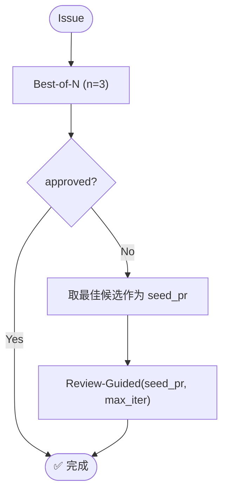

### 2.5 完整序列（review_guided 策略）

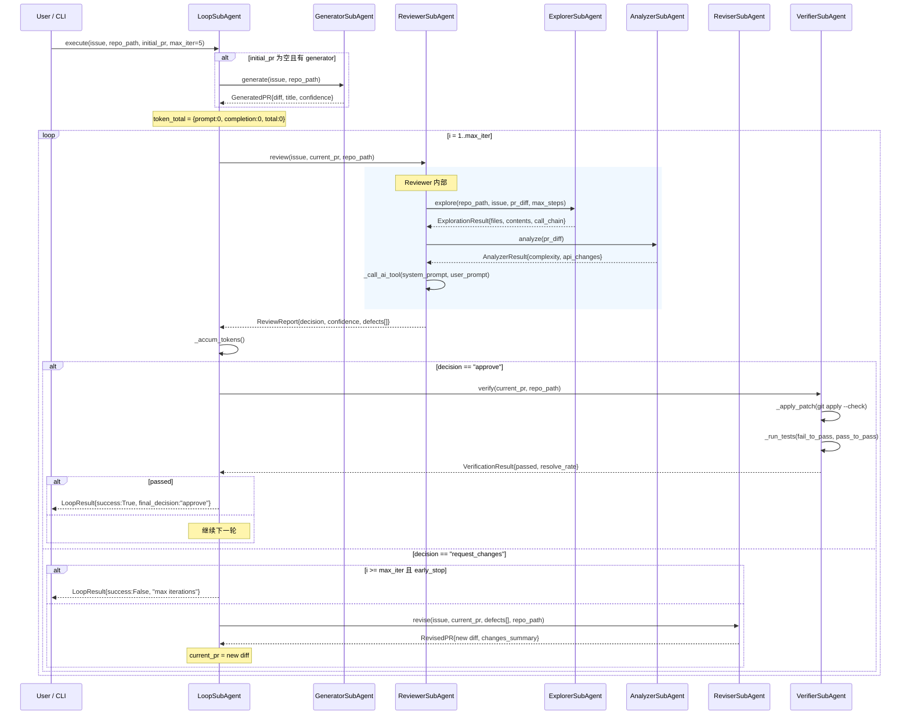

---

## 3. 数据模型

核心 dataclass 关系：

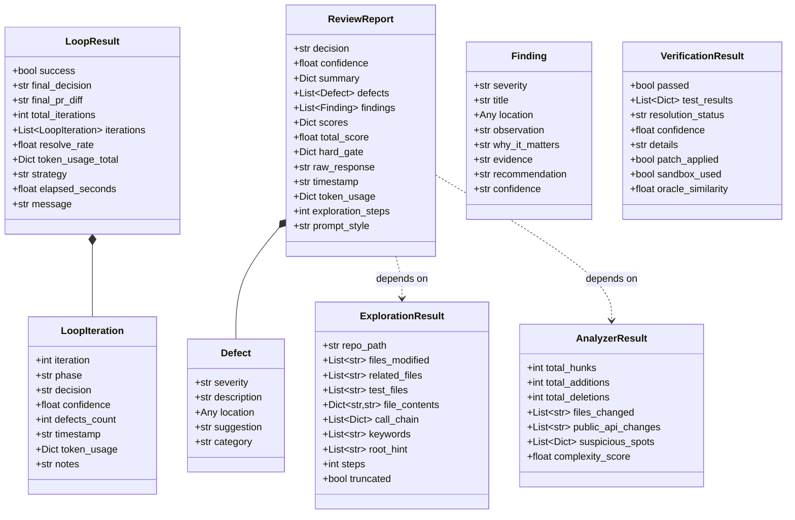

---

## 4. 快速开始

```bash
# 1. 安装
cd swe-review-plugin
./install.sh
source .env.local

# 2. 看工具可用性
swe-review list-tools

# 3. 跑一次 review
swe-review review \
    --issue "Bug description" \
    --pr-title "Fix ..." \
    --pr-diff ./sample.diff \
    --repo-path /path/to/repo \
    --tool pi

# 4. 跑 review_guided 闭环
swe-review loop \
    --issue "Bug" \
    --repo-path /path/to/repo \
    --strategy hybrid \
    --max-iterations 5

# 5. 安装 SKILL.md 到 Pi（install.sh 已经做过；这里手动重做）
swe-review install-skills
```

### 完整测试周期

`install.sh` 提供 5 个子命令。默认是 `install`：

| 子命令 | 说明 |
|-------|------|
| `./install.sh install` | 安装 swe-review 包 + 复制 SKILL.md 到 `~/.claude/skills/` 和 `~/.pi/agent/skills/` |
| `./install.sh uninstall` | 卸载 swe-review 包 + 清除所有已安装的 SKILL.md + 删除 `.env.local` |
| `./install.sh verify` | 运行单元测试（pytest）+ `swe-review list-tools` |
| `./install.sh test-all` | `install` → 4 个 CLI smoke → `uninstall` 闭环 |
| `./install.sh test-tool pi` | `install` → 单个 CLI 跑一次 `review` → `uninstall` 闭环 |

`test-all` 输出末尾会给出各 adapter 的健康状态：

```
==== Phase 2 总结 ====
  claude-code    PASS  ok
  cursor         FAIL  RuntimeError  （Cursor 服务端 quota，与代码无关）
  opencode       PASS  ok
  pi             PASS  ok
```

每个 adapter 都提供 `diagnose()` 方法，将错误原因反馈到 `swe-review health`。

### Python API

```python
import asyncio
from swe_review import ReviewSkill, ClaudeCodeAdapter

async def main():
    skill = ReviewSkill(tool_adapter=ClaudeCodeAdapter())
    res = await skill.execute(
        issue="NullPointer in user_service.get",
        pr_title="Add null check",
        pr_diff=open("pr.diff").read(),
        repo_path=".",
    )
    print(res.payload)  # → SkillResult {ok, payload: ReviewReport.to_dict()}

asyncio.run(main())
```

---

## 5. Skill / SubAgent / Adapter 三层

### 5.1 Skill 层（`swe_review/skill.py`）

每个 Skill 是给上游 LLM/用户调用的"一段可复用能力"，负责准备上下文、触发 SubAgent、封装对外结果。

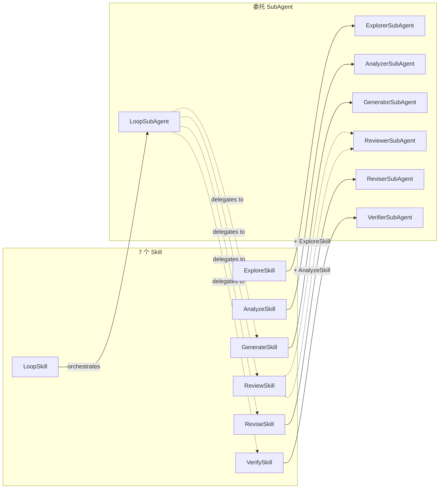

| Skill | 用途 | 对应 SubAgent | 额外依赖 |
|------|------|---------------|----------|
| `ExploreSkill` | 收集仓库上下文 | `ExplorerSubAgent` | — |
| `AnalyzeSkill` | 静态 diff 分析 | `AnalyzerSubAgent` | — |
| `GenerateSkill` | 基于 issue 生成候选 PR | `GeneratorSubAgent` | `ExploreSkill` |
| `ReviewSkill` | 审查候选 PR | `ReviewerSubAgent` | `ExploreSkill` + `AnalyzeSkill` |
| `ReviseSkill` | 按审查反馈修订 PR | `ReviserSubAgent` | — |
| `VerifySkill` | 沙箱 apply + 测试 | `VerifierSubAgent` | — |
| `LoopSkill` | 编排闭环 | `LoopSubAgent` | 上述全部 |

#### Reviewer prompt styles（`prompt_style`）

| style | 定位 |
|---|---|
| `engineering`（默认） | **高级代码审查**：审查对象是 Change 而非 Bug。8 维度 100 分制评分（Design 20 / Maintainability 15 / Consistency 15 / Simplicity 10 / Readability 10 / Testability 10 / Risk 10 / Change Scope 10）+ P0–P4 证据绑定 findings + Hard Gate + 4 档决策（APPROVE / APPROVE_WITH_SUGGESTIONS / REQUEST_CHANGES / BLOCK）。先理解再评价，Project Convention > Generic Best Practice，禁止低价值评论。 |
| `concise` | legacy bug-fix-centric：判断 patch 是否修复 issue 根因。 |
| `detailed` | legacy bug-fix-centric：Step 1→6 workflow + symptom-fix detection。 |

engineering 报告同时把 findings 映射为 legacy `defects`（P0/P1→high，P2→medium，P3/P4→low），revise/loop 下游无需改动；`approve_with_suggestions` 与 `approve` 一样终止闭环为成功，`block`（Hard Gate / P0）与 `request_changes` 触发修订。

### 5.2 SubAgent 层（`swe_review/subagents/`）

执行单元，全部有 `name / capabilities / get_status` 元信息。

| SubAgent | capabilities | 核心方法 |
|----------|-------------|----------|
| `ExplorerSubAgent` | `file_search, code_analysis, dependency_tracking, test_discovery` | `execute(context)` → `ExplorationResult` |
| `AnalyzerSubAgent` | `static_diff_analysis, api_surface_check, complexity_estimate` | `execute(context)` → `AnalyzerResult` |
| `GeneratorSubAgent` | `generate_patch, diff_formatting` | `execute(context)` → `GeneratedPR` |
| `ReviewerSubAgent` | `analyze_diff, explore_repository, generate_report, decision_making` | `execute(context)` → `ReviewReport` |
| `ReviserSubAgent` | `parse_feedback, generate_fix, validate_diff` | `execute(context)` → `RevisedPR` |
| `VerifierSubAgent` | `run_tests, compare_patches, verify_resolution, sandbox_apply` | `execute(context)` → `VerificationResult` |
| `LoopSubAgent` | `orchestrate_loop, track_iterations, early_stopping, best_of_n` | `execute(context)` → `LoopResult` |

所有 SubAgent 接收的 `context` 字典是显式 schema —— **拒绝** `golden_patch`、`test_info`、`oracle` 等污染字段（验证器除外）。

### 5.3 Adapter 层（`swe_review/tools/`）

只负责 `chat(system, user) → (text, token_usage)`。所有 adapter 共享 `BaseAdapter` 接口：

```python
class BaseAdapter:
    async def chat(self, system: str, user: str,
                   max_tokens: int = 4096, temperature: float = 0.1
                   ) -> Tuple[str, Dict[str, int]]: ...
    def get_status(self) -> Dict[str, Any]: ...
    def diagnose(self) -> Dict[str, Any]: ...
```

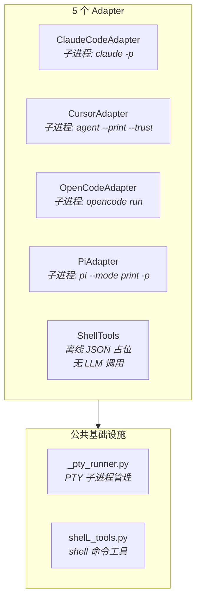

| Adapter | CLI 二进制 | Headless 模式 | 技能自动安装 |
|---------|-----------|---------------|-------------|
| `ClaudeCodeAdapter` | `claude` | `claude -p --output-format json` | ❌ |
| `CursorAdapter` | `agent` | `agent --print --trust` | ❌ |
| `OpenCodeAdapter` | `opencode` | `opencode run` | ❌ |
| `PiAdapter` | `pi` | `pi --mode print -p --skill <path>` | ✅ → `~/.pi/agent/skills/` |
| `ShellTools` | (无) | 返回占位 JSON | ❌ |

---

## 6. CLI 命令

```
swe-review list-tools                                  # 列出 adapter 健康状况
swe-review health                                      # 每个 adapter 发一次 trivial prompt
swe-review install-skills [--source ...] [--pi-skills-dir ...]

swe-review review    --issue ... --pr-diff ... \
                     [--tool pi] [--prompt-style engineering|concise|detailed] [--deep]

swe-review revise    --issue ... --pr-diff ... \
                     --review-report ... [--feedback-level full_feedback]

swe-review loop      --issue ... --repo-path . \
                     [--strategy hybrid] [--max-iterations 5] [--n-best-of 3]

swe-review verify    --pr-diff ... \
                     [--repo-path .] [--sandbox] [--test-info ...] [--oracle ...]
```

完整参数见 `swe-review -h`。

### CLI 层架构

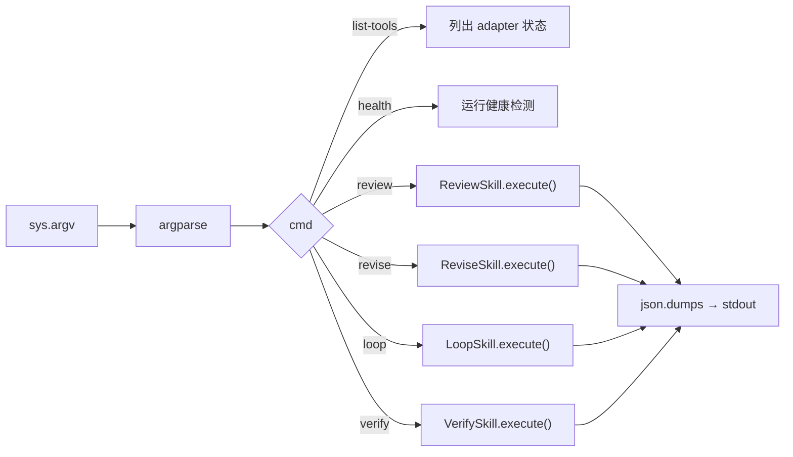

---

## 7. 在 Claude Code / Cursor / OpenCode / Pi 中使用

### 7.1 Claude Code / OpenCode

`./install.sh` 把每个 Skill 复制到 `~/.claude/skills/swe-review-*/`（软链接到 `~/.agents/skills/`）。OpenCode 默认加载该目录：

```
/skill swe-review-review  --issue "..." --pr-diff ./patch.diff
/skill swe-review-loop    --issue "..." --repo-path . --strategy hybrid
```

### 7.2 Pi

```
/skill:swe-review-review --issue "..." --pr-diff ./patch.diff
/skill:swe-review-revise --issue "..." --pr-diff ./patch.diff --review-report ./report.json
```

Pi 把 `~/.pi/agent/skills/` 当成发现根目录。`PiAdapter` 还会按需把 SKILL.md 复制到该路径下。

### 7.3 Cursor

Cursor 终端无原生 `skill` 概念，但 `agent --print --trust` 会被 `CursorAdapter` 包装成 headless 执行。建议在 Cursor 终端直接调用：

```bash
swe-review review --issue "..." --pr-diff ./fix.patch --tool cursor
```

### Skill 发现路径

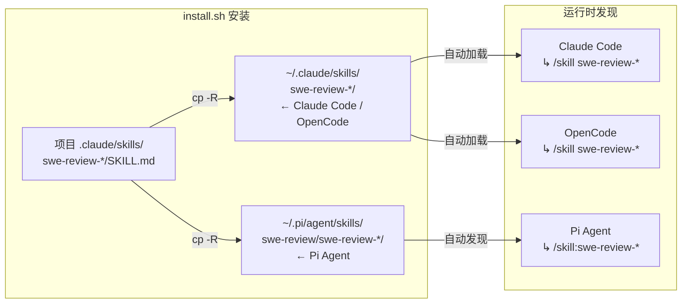

---

## 8. 评测指标

| Metric | 定义 | 本插件在哪收集 |
|--------|------|---------------|
| **CR (Completion Rate)** | reviewer 输出可解析 JSON 的比例 | `ReviewerSubAgent._parse_response` 成功分支 |
| **DA (Decision Accuracy)** | approve/request-changes 与 ground-truth 一致 | `VerifierSubAgent` 提供 oracle 对照（**不进** review prompt） |
| **RRR (Resolve Rate after Revision)** | approved 后实际解决率 | `LoopSkill` 的 `resolve_rate`（= verifier 状态 → 1.0 / 0.5 / 0.0） |

### 评测模式的数据隔离

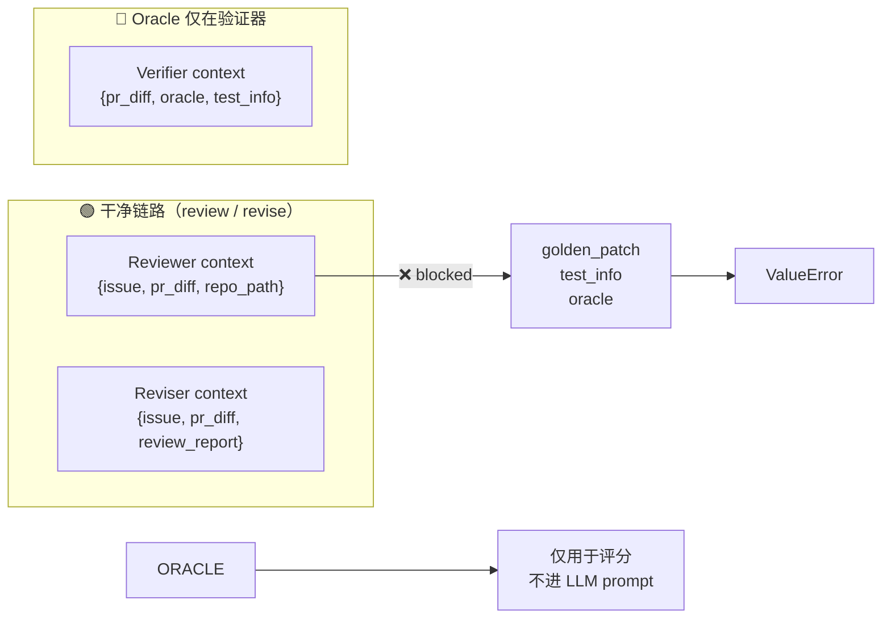

注：本仓库不下载 SWE-bench 数据集；评测脚本请按你本地 SWE-Review-Bench 接入即可。

---

## 9. 安全约束与不变式

### 不变式矩阵

| 不变式 | 执行者 | 违反后果 |
|--------|--------|---------|
| `golden_patch` 不得出现在 review 上下文 | `ReviewerSubAgent.execute()` | `raise ValueError` |
| `oracle` / `test_info` 不得出现在 review 上下文 | `ReviewerSubAgent.execute()` | `raise ValueError` |
| `golden_patch` / `oracle` 不得出现在 revise 上下文 | `ReviserSubAgent.execute()` | `raise ValueError` |
| `golden_patch` / `oracle` 不得出现在 loop 上下文 | `LoopSubAgent.execute()` | `raise ValueError` |
| diff 必须可通过 `git apply` 校验 | `ReviserSubAgent._parse_response()` | `status = "failed"` |
| Verifier 默认使用沙箱 | `VerifierSubAgent.__init__(sandbox=True)` | 污染用户工作区 |
| Reviewer 输出必须是可解析 JSON | `ReviewerSubAgent._parse_response()` | fallback `request_changes` |

### Verifier 沙箱流程

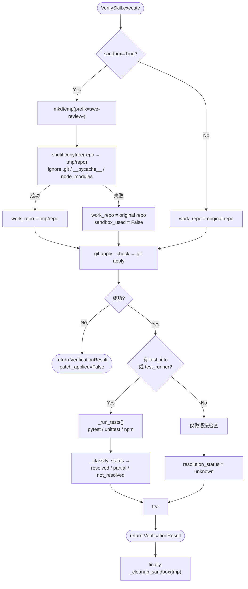

---

## 10. 参考与许可

- 论文：*SWE-Review: Closing the Loop on Issue Resolution with Agentic Code Review*（项目内 `SWE-Review-2607.06065.pdf`）
- Claude Code：`https://code.claude.com`
- Cursor：`https://cursor.com`
- OpenCode：`https://opencode.ai`
- Pi：`https://github.com/badlogic/pi-mono`
- License: MIT
